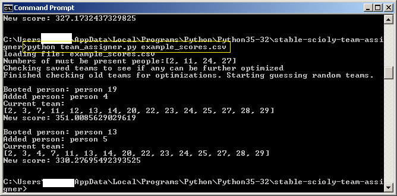
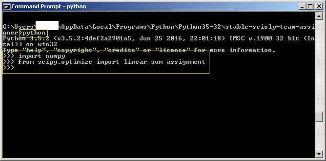
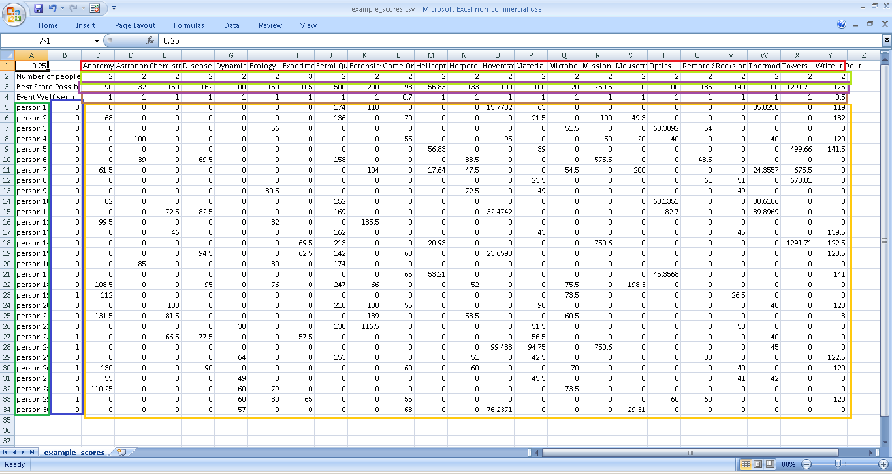

# scioly-team-assigner
This python script chooses and assigns to events a team of 15 people from a list of candidates. It optimizes the sum of their test scores.

## Features
*Guaranteed that each assignment of 15 people to events maximizes the sum of their test scores. (Test scores are normalized to 0-1).
*Respects the event schedule. (Only 1, though. Can't optimize for both States and Nationals if the schedules are different).
*Respects 7 senior limit.
*Supports 3 person events.
*Supports low-score-wins events (gives the worst person a participation score of 10%, and somebody with a score of 0 100%)
*Supports custom weighting for events (if you think that Write It Do It scores should not be weighted as heavily as Astronomy in its optimizing process, you can do it).
*Supports inputting data from multiple invitationals and weighting that data differently. (If you think somebody's score on the MIT invite test should matter more than the preliminary testing your team had, it can be done.)
*Supports forcing certain people (like the officers) to be present on the team.
*Generates multiple teams and orders them by score.
*Supports giving events to people who have not competed in them.
*Takes ~30 seconds per optimization attempt (selecting from 30 people on a 2011 i3 laptop. Scaling law unknown.), but it can be parallelized by running two (or more) copies of the program in parallel.

### Notable things the team assigner CANNOT do
*Only as good as the data you give it (see section on data inputs for more)
*No guarantee of optimally choosing 15 people from the list of candidates. However, after trying 20-30 teams it is unlikely to find a better. Also, after a minor score tweak, See section on the algorithm for more.
*Cannot select two equal (unstacked) teams.

## Getting Started
Make a new folder to put everything in. Then download everything in the Github repo. To run, open a command line and navigate to the folder. Then run 'python team_assigner.py' followed by the names of the csv files with data in them:
```
python team_assigner.py example_scores.csv
```

Replace example_scores.csv with whatever the names of your score sheets are. There can be multiple csv files included.

### Needed packages
* Python (The latest 3.x is the supported version, but it will probably run with Python 2.7).
* Numpy. A fast computation package for Python not included in the standard distribution (but very widely used).
* Scipy library. This supplies the Hungarian algorithm used to assign people to events.

####Checking your Python configuration:

Open a command line. Run:
```
python
```
When the Python shell loads, run:
```
import numpy
from scipy.optimize import linear_sum_assignment
```

If either of these commands causes an error, you don't have that package installed. A successful test does nothing, like this:


### Output
The teams the assigner comes up with are put in a text file, team_config.txt. They are sorted by score. Duplicates are removed.

#### Loading prior generated teams
The assigner also produces an 'outfile' (no extension). This is a non-human-readable file that stores the output teams so that, when the assigner is next run, they can be loaded in and included in the list of teams generated.

Each time the team assigner is restarted, it loads in the teams in the outfile and sees if they can be optimized further. If the input data has not changed, this will not be possible. If it has, the assigner will iterate over all the teams and see if they can be further optimized. This will take 15-30 seconds per team (depending on the amount of optimization possible).

## Input Data

### Event schedule

### Score spreadsheets
These must be csv files (csv, comma delimited in Excel - NOT MS-DOS or Macintosh) in a specific format. Probably modifying and renaming the example is your best bet. They are composed of several components. Here is an example CSV, marked up to show specific regions.


#### Invite Weight - Box A1 (black box)
This is how much the program should consider this particular invitational (or testing). It is relative (and does nothing when there is only 1 spreadsheet): internally the weights are scaled so they sum to 1.

#### People Names - A5 on down (dark green box)
The names of all the candidates. They MUST be consistent across ALL spreadsheets inputted.

#### Who is a senior - B5 on down (blue box)
A 1 if that person is a senior, 0 if not. Any other value will throw an error. They MUST be consistent across ALL spreadsheets inputted.

#### Event Names - C1 on over (red box)
The name of the event. They MUST be consistent across ALL spreadsheets inputted.

#### The number of people on the event - C2 on over (light green box)
How many people on the event ("A team of up to:" entry in event description). They MUST be consistent across ALL spreadsheets inputted.

#### Top score - C3 on over (purple box)
The score of the 1st place team. This is to normalize scores so that an event out of 400 won't count for more than an event out of 50. If you don't know this, you have two options: either enter the maximum test score (also good if this is your own team's team selection testing) or make a linear guess of the 1st place score by doing [your score]*[number of teams]/([number of teams] - [your placing]). But apply the same method to every event in the same invite.

If it's a low score wins event, put down 0.

#### Event Weights - C4 on over (brown box)
How much you want each event to count. The example spreadsheet counts Game on a little less and WIDI a lot less than the other events. They MUST be consistent across ALL spreadsheets inputted.

#### Scores (yellow box)
Put down the test scores (not placings). If that person did not participate, put down 0. (Excel has a great feature where you do  Ctrl-F, input nothing in the 'find' field, and then replace all with 0, filling in any square with nothing in it.)

##### How to deal with invite scores, where 2 people do 1 event, and carrying.
Technically, each person's score is the score that they would get if they did the event matched with people of equal ability. So if each partner did equal work (the default assumption), just enter the pair's score for each person. But if you suspect that one partner did more than the other, adjust the higher-contributing partner's score up and the lower contributing partner's score down.

## Algorithm

### Fuse scores across invites

### Assign people to events
This part is based on the Hungarian algorithm. Each person (row) on the team is split into blocks (for example, person 26 block1, person 26 block 2, etc.). Each person-block is given that person's test scores ONLY in the events for that block (all other events set to 0).

Each event (column) is also split into single person events, with the number of single person events generated equal to the number of people on that event. 

Bogus events (with test scores of 0) are generated to fill up this matrix to a square matrix.

Using the Hungarian algorithm, each person-block is assigned to a mono person event so as to maximize the sum of the normalized test scores. If that person-block is assigned to a bogus event, that person has no event that time slot. If an event was assigned to a person with a test score of 0 for that event, it is listed as being unassigned.

### Choose best team of 15
Start with a random team. 

Figure out who contributes LEAST to that team by taking every subset of 14, assigning and scoring it, and then seeing which sub-team is the best (so the person who was removed contributed the LEAST). Experimentally kick that person out. Find out, of the people NOT in the new team of 14, who would be the best replacement (which team of 14 + a new person scores the best). If the new person is different than the old person, we have found a better replacement person. Replace the old person with the new one and do this cycle again. If the new person is the same as the old person, try experimentally replacing with the 2nd (or 3rd, 4th, etc.) least contributing person. If nobody on the team can be removed, optimizing is finished.

### Score a team
Get the sum of the normalized test scores of the people assigned to each event. Divide by the number of people on that event. Then do 60*(1- that number). This says that if both people have normalized scores of 1, they get 1st place. If both have scores of 0, they get last place. The 60 is an arbitrary constant, chosen as the number of teams in the national tournament.